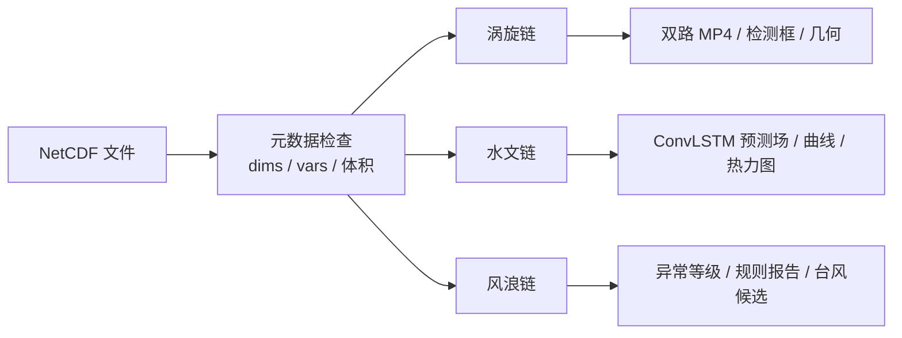

# NetCDF 数据预处理归档（做了什么）

> **归档重点**：收到 NetCDF 之后，对**维度 / 变量 / 数值**做哪些检查与变换，**哪些字段进入哪个模块**，最终**变成什么结果**。  
> 不展开 Streamlit/React 页面交互；入口差异见文末「接入方式」。  
> 更新：2026-05-15

---

## 1. 总览：两条流水线

| 流水线 | 触发方式 | 目的 | 典型产物 |
|--------|----------|------|----------|
| **在线演示 / 离线大屏** | 上传单个或多个 NC → API 或页面 | 不（或少量）落盘 `data/processed`，当场读 NC 推理 | MP4、曲线、规则报告、热力图 |
| **训练批量预处理** | `scripts/run_preprocess.sh`、`python -m src.preprocess.*` | 全量格点 → 滑窗样本 + 统计量 | `data/processed/hydro/*.npz`、`hydro_zscore.npz` 等 |

二者共用同一套 **变量名匹配** 与 **缺测处理** 约定（`open_netcdf_dataset`、`config/variable_map.yaml`）。

---

## 2. 收到 NC 后：统一检查（尚未做格点变换）

**代码**：`app/services/nc_ingest_service.summarize_nc_file`（`netCDF4` 只读）；上传落盘 `app/data/nc_uploads/`（`save_uploaded_nc*`）。

| 检查项 | 做法 |
|--------|------|
| 格式 | 后缀 `.nc` / `.nc4` / `.cdf`；单文件建议 ≤500MB |
| 维度 | 读出全部 `dimensions` 及长度（如 `time×lat×lon`） |
| 变量 | 列出 `data_vars` 名称（**不**加载全量格点） |
| 体积 | 文件 MB 数 |
| 失败 | 返回 `error` 字符串，不进入下游 |

**不做**：重采样、滑窗、Z-score、写 `processed/*.npz`。  
`nc_preprocess_facade.describe_for_branch` 仅把上述摘要按分支（eddy/hydro/windwave）打包 JSON，**不触发**下列各节变换。

**打开方式**：`src/preprocess/netcdf_io.open_netcdf_dataset` — xarray 读盘；Windows 长路径/中文路径可走临时副本或短路径。

---

## 3. 变量约定：同一 NC 如何分流到三模块

系统按 **变量名候选列表** 自动匹配（大小写不敏感）；同一文件可能只满足部分模块。

### 3.1 涡旋（ADT/流场 或 SST/流场）

**代码**：`src/eddy/nc_to_bgr.py`、`src/eddy/nc_dual_batch.py`

| 优先级 | 通道语义 | NetCDF 变量候选（每组取第一个存在的） |
|--------|----------|--------------------------------------|
| 1 | 动力高度 + 地转流 | `adt/ADT` + `ugos/UGOS` + `vgos/VGOS` |
| 2 | 海表高度异常 + 流 | `sla/SLA/ssh/SSH` + `ugos/UGOS` 或 `ssu/SSU` + `vgos/VGOS` 或 `ssv/SSV` |
| 3 | 海域要素演示 | `sst/SST` + `ssu/SSU` + `ssv/SSV` |

**检查**：三通道空间形状一致；有 `time` 维则记录 `time_len`、`time_index`、`time_label`。

### 3.2 水文（四要素格点序列）

**代码**：`config/variable_map.yaml` → `src/preprocess/hydro_nc_stack.stack_hydro_fields`

| 内部名 | NetCDF 候选 |
|--------|-------------|
| temp | SST, sst |
| sal | sss, SSS, … |
| u | SSU, ssu |
| v | SSV, ssv |

**检查**：每个要素为 4D `(T, lat, lon)`；多日文件按文件名/路径排序后 **time 维拼接**。

### 3.3 风浪（区域平均时序）

**代码**：`src/preprocess/anomaly_dataset.extract_wind_wave_series_from_netcdf`

| 分量 | NetCDF 候选 | 处理 |
|------|-------------|------|
| 风速 | `u10,v10`（或同类） | \( \sqrt{u^2+v^2} \)，再对空间维 **平均** → 1D 时序 |
| 浪高 | `swh/hs/...` | 空间平均 → 1D；若无浪高仅有风，则 **浪高用风速复制**（`used_wave_fallback=1`） |

**检查**：至少要有风或浪；非有限值计数后 **`nan_to_num` → 0**。

---

## 4. 在线路径：对数据「做了什么」→ 进入哪一模块 → 得到什么

以下对应 **React 离线大屏 API**（`web_api/*`）与 **Streamlit 各模块页** 共用服务层逻辑。

### 4.1 涡旋链（NC → 双路 MP4）

**入口**：`POST /api/eddy/dual-mp4` → `EddyDemoService.infer_netcdf_dual_mp4`  
**权重**：默认 `AutoDL/outputs/eddy_enh/train/weights/best.pt`（8 通道）；可回退 3 通道 `outputs/eddy/best.pt`。

| 步骤 | 对数据的操作 | 形状 / 类型变化 |
|------|----------------|-----------------|
| 1. 规划时间索引 | 读 `time_len`；按 stride、上限 `max_frames`（默认 120）、`EDDY_DUAL_MAX_INFER_FRAMES`（默认 120）均匀抽样 | `indices[]` |
| 2. 批量读场 | **打开 NC 一次**，`isel(time=indices)` 取出三标量场 | 每帧 `(H,W)` float64 ×3 |
| 3. 可视化底图 | 每帧三通道 2–98% 分位拉伸 → RGB → BGR | `(H,W,3)` uint8 |
| 4. YOLO 输入（8ch 模型） | 由 ADT,U,V 算涡度、Okubo-Weiss、Laplacian、粗尺度残差、梯度幅等 → **8 通道** HWC，×255→uint8 | `(H,W,8)` |
| 5. YOLO 推理 | `conf/iou/imgsz` 过滤；批量 predict | 每帧检测框 + conf |
| 6. 叠绘 | 细框 + 置信度文字（与表格 `max_conf` 同源） | 带框 BGR |
| 7. 编码 | 帧序列 → ffmpeg H.264（可 NVENC） | `eddy_nc_base_*.mp4`、`eddy_nc_ann_*.mp4` |

**并行**：抽帧后物理堆叠可多进程（`EDDY_DUAL_EXTRACT_WORKERS`）；YOLO 在 GPU 上批推理。

**模块结果**：

- 上路的底图/流场 MP4  
- 下路的检测框 MP4  
- `detection_timeline[]`：`time`、`max_conf`（当帧最高框分）、`mean_conf`、`count`、`status`  
- 可选单帧：`infer_netcdf_frame` → `annotated_frame_bgr`、`geometries`

**数值注意**：画面上大量 0.xx 是弱检测框；表格 `max_conf` 为**当帧所有框的最大值**，8ch 模型下常有框到 1.0。

---

### 4.2 水文链（NC → 曲线 + 热力图）

**入口**：`POST /api/hydro/heatmap`、`/meta`；Streamlit `HydroInferenceService.materialize_netcdf_to_xy_npz`  
**配置**：`config/hydro_hycom.yaml`（`input_steps`、`output_steps`、`grid_shape`、四要素名）

| 步骤 | 对数据的操作 | 形状变化 |
|------|----------------|----------|
| 1. 多文件排序 | 按 `YYYYMMDD` stem 排序，**time 维拼接** | `(T,H,W,4)` float32 |
| 2. 缺测 | 统计非有限个数；`nan/inf → 0` | 同上 |
| 3. 滑窗 | `input_steps` 输入窗 + `output_steps` 预测窗，stride 可配 | `X: (N,T_in,H,W,C)`，`y: (N,T_out,H,W,C)` |
| 4. 标准化 | 优先读 `data/processed/stats/hydro_zscore.npz` 的 mean/std；否则**本次上传滑窗现算** Z-score | 标准化后的 X/y |
| 5. 推理 | ConvLSTM（`outputs/hydro_l2/best.pt` 等） | 预测场与真值场 |
| 6. 展示 | 取最后一窗或指定 `lead_time_index` 切片 | 2×2 曲线（gt/pred）、MapLibre 热力图格点 |

**模块结果**：

- 要素曲线：`temp/sal/u/v` 的 gt 与 pred 时序  
- 热力图：`lons/lats/values`（`feature` + `kind=pred|gt|abs_err`）  
- meta：`T_need`、`T_hat`、`buffer_sufficient`、是否用全局 zscore

**限制**：`T < input_steps + output_steps` 时不凑假窗；网格与 `grid_shape` 不一致时仅警告。

---

### 4.3 风浪链（NC → 异常报告 + 台风候选）

**入口**：`POST /api/windwave/offline-report`  
**代码链**：`build_eddy_result_from_windwave_netcdf` → `build_anomaly_result_for_detect` → `run_detect` → `render_report`

| 步骤 | 对数据的操作 | 结果字段 |
|------|----------------|----------|
| 1. 提取时序 | 风、浪 1D 序列（见 §3.3） | `demo_wind_observed`、`demo_wave_observed` |
| 2. 一步预测 | **WindWaveLSTM** 滑窗（`config/anomaly.yaml` + `outputs/anomaly/best.pt`）；T 不足或缺权重时 **降级** 3 点平滑 | `demo_wind_predicted`、`demo_wave_predicted`、`prediction_backend` |
| 3. 残差曲线 | \(\|wind_{obs}-wind_{pred}\| + \|wave_{obs}-wave_{pred}\|\) 逐时刻 | `current_curve` |
| 4. 时空窗 | 优先从 NC 坐标读 time/lon/lat；否则 `config/data.yaml` 海区 + `demo.yaml` 外扩 | `start_time/end_time`、`lon/lat_*` |
| 5. 异常判定 | 残差相对均值/标准差 → **3σ** 规则 | `anomaly_level`、`anomaly_index` |
| 6. 台风检索 | `events.json` 时空过滤 + 可选 **DTW** 重排 | `typhoon_candidates[]` |
| 7. 报告 | 模板拼接 | `report_text`（Markdown 式全文） |

**说明**：在线主路径为 **LSTM 一步预测**（`src/anomaly/inference.py`）；仅当缺 `best.pt`、序列长度不足滑窗或推理异常时降级为平滑基线，并在 `wind_wave_assessment_note` / API `prediction_backend` 中标注。  
LLM 解读（`POST /api/windwave/llm-report`）吃的是 **第 5–6 步的结构化 JSON**，不再读格点。

**模块结果**：规则报告全文、异常等级、台风相似事件表（依赖 `data/processed/anomaly/typhoon_kb/events.json`）。

---

## 5. 训练批量预处理（离线落盘，供 `python -m src.hydro.train` 等）

与上传演示 **分离**；从 `config/data.yaml` 的 `raw_root` 扫描命题方日文件。

### 5.1 水文 `data/processed/hydro/`

**命令**：`python -m src.preprocess.hydro_dataset --from-nc`（或 `scripts/run_preprocess.sh`）

| 步骤 | 操作 |
|------|------|
| 发现文件 | `海域要素预测/**/*.nc`，可按 `hydro_year_split` 分 train/val/test 年 |
| 拼接 | 同 §4.2，得 `(T,H,W,4)` |
| 滑窗 | `build_windows` → 大量 `(N, T_in, H, W, C)` 样本 |
| Z-score | **仅在训练集滑窗上** fit mean/std → 写入 `data/processed/stats/hydro_zscore.npz` |
| 应用 | train/val/test 均用该 mean/std 标准化 |
| 写出 | `data/processed/hydro/X_train.npz` 等（与 `config/hydro_hycom.yaml` paths 对齐） |

### 5.2 风浪 `data/processed/anomaly/`

**命令**：`python -m src.preprocess.anomaly_dataset`（风浪日 NC 目录）

| 步骤 | 操作 |
|------|------|
| 读序列 | 多日 NC → 拼接 `(T,2)` 风/浪 |
| 滑窗 | `window_hours` / `horizon_hours` 转为步长（3h 数据） |
| 写出 | `train_sequences.npz` 等（`X` 窗口、`y` 目标） |

### 5.3 台风查询（非单 NC，是历史 CSV）

**命令**：`scripts/build_typhoon_kb.py`（源：`data/raw/typhoon/ibtracs/...csv`）

| 步骤 | 操作 |
|------|------|
| 聚合 | IBTrACS 轨迹 → 事件级 `start/end`、bbox、峰值风速 |
| 写出 | `data/processed/anomaly/typhoon_kb/events.json`、`retrieval_index.json` |

供 §4.3 第 6 步检索，**不**由用户上传 NC 直接生成。

### 5.4 涡旋训练集

YOLO 数据多为 **图像/NPZ 标注** 或裁剪子域 NC（`scripts/extract_eddy_subset_nc.py` 等），8 通道训练张量语义见 `src/eddy/stacked_physics.py`（与在线 §4.1 第 4 步一致）。全图日 NC 批量进 YOLO 训练集的路径与命题方 META 数据对齐，见 `data/README_data.md`。

---

## 6. 缺测与数值口径（跨模块）

| 现象 | 处理方式 |
|------|----------|
| NetCDF `_FillValue` / 陆地缺测 | 解码后多为 NaN；水文拼接后 **计数并 `nan_to_num→0`** |
| Z-score | 训练集 `nanmean/nanstd`；推理优先用已保存 stats |
| 风浪在线 pred | LSTM 滑窗；缺权重/T 不足时平滑降级 |
| 涡旋显示拉伸 | 每帧 2–98% 分位数归一化到 0–255，**非**物理单位保留 |

---

## 7. 演示用合并 NC 示例

`data/processed/demo/offline_test_merged_t300.nc`（脚本 `scripts/build_offline_test_merged_nc.py`）：

- 含 **time×lat×lon** 多要素，供三模块同屏演示；  
- 涡旋：1993 年起时间轴 + SST/SSU/SSV 或 ADT/流场（视变量而定）；  
- 风浪：2015 段子序列 + u10/v10 等（见实际 `data_vars`）；  
- 水文：可缓冲多日或单文件滑窗（视上传策略）。

具体变量以 `summarize_nc_file` 或 `ncdump` 为准。

---

## 8. 接入方式（仅作索引，非本文重点）

| 入口 | 数据路径 |
|------|----------|
| React 上传 | `POST /api/offline/nc` → 相对路径 → 直接 §4 |
| Streamlit 离线页 | 上传 + Facade 摘要（§2）+ 可选单帧涡旋 |
| 训练 | 不经过上传目录，读 `服创数据集/` 等 → §5 |

---

## 9. 关键代码索引

| 主题 | 路径 |
|------|------|
| NC 摘要 | `app/services/nc_ingest_service.py` |
| 打开/写出 NC | `src/preprocess/netcdf_io.py` |
| 涡旋变量匹配与 BGR/8ch | `src/eddy/nc_to_bgr.py`、`nc_dual_batch.py`、`stacked_physics.py` |
| 双路 MP4 编排 | `app/services/eddy_demo_service.py` |
| 水文变量映射 | `config/variable_map.yaml` |
| 水文拼接/滑窗/zscore | `src/preprocess/hydro_nc_stack.py`、`hydro_nc_infer_build.py` |
| 水文批量建库 | `src/preprocess/hydro_dataset.py` |
| 风浪时序提取 | `src/preprocess/anomaly_dataset.py` |
| 风浪 NC→报告 | `src/anomaly/windwave_nc_bridge.py`、`detect.py`、`report.py` |
| 台风检索 | `src/anomaly/typhoon_kb.py` |
| 命题数据说明 | `docs/架构与方法/命题方数据集说明.md`、`data/README_data.md` |

---

## 10. 与「系统功能」文档的边界

- **本文**：数据从 NC 到各模块产物的**变换步骤与产物形态**。  
- **系统交互**：`docs/工程手册/归档_实时系统离线系统与三模块改动.md`（导航、上传 UI、会话状态）。  
- **不可更改约定**：`相关文件/AI_DEV_REQUIREMENTS.md`（eval 字段、config level、PyTorch 版本等）。
