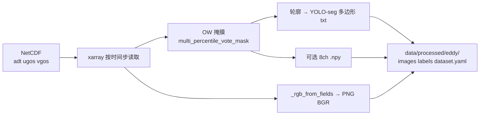

# NetCDF 与三模块数据及训练说明

> 归档：NC 变量含义、三模块分流、预处理脚本与训练脚本代码导读。  
> 更新：2026-05-16

---

## 1. 什么是 NetCDF

**NetCDF**（Network Common Data Form）是地球科学、海洋与气象领域常用的**自描述数组文件格式**（常见后缀 `.nc`、`.nc4`、`.cdf`）。

| 概念 | 含义 |
|------|------|
| **维度** | 坐标轴，如 `time`、`lat`、`lon`、`depth` |
| **变量** | 实际数据场，如 `SST`、`u10`，各变量有自己的维度组合 |
| **属性** | 元数据：单位、`long_name`、缺测值 `_FillValue` 等 |
| **读取方式** | 本项目用 **xarray** / **netCDF4** 按变量名打开，**不必**事先约定「第 0/1/2 通道」 |

与本项目的关系：上传或批量目录中的 NC，经 **变量名匹配**（`config/variable_map.yaml`、涡旋/风浪各自候选列表）映射到内部 `temp/sal/u/v` 或涡旋 RGB/OW 等，再进入各模块。详见 [离线系统_预处理数据归档.md](../工程手册/离线系统_预处理数据归档.md)。

---

## 2. NC 变量与各模块

命题方 NC **没有统一的通道编号**；下表为**逻辑分量**与 NetCDF 变量名候选。

### 2.1 水文（ConvLSTM）

**配置**：`config/variable_map.yaml`  
**堆叠**：`src/preprocess/hydro_nc_stack.py` → 滑窗 NPZ  
**训练/推理**：`src/hydro/train.py`、`HydroNpzDataset`

| 内部名 | 物理量 | NetCDF 候选 | 训练张量 |
|--------|--------|-------------|----------|
| temp | 海温 | SST, sst | X/y 中通道维，Z-score 后 |
| sal | 盐度 | sss, SSS, … | 同上 |
| u | 纬向流 | SSU, ssu | 同上 |
| v | 经向流 | SSV, ssv | 同上 |

形状：多日文件按时间拼接后为 `(T, lat, lon)` 四要素 → 滑窗 `(N, T_in, H, W, C)` / `(N, T_out, H, W, C)`。

### 2.2 涡旋（YOLOv8-seg）

**在线演示**：`src/eddy/nc_to_bgr.py`、`src/eddy/nc_dual_batch.py`（读 NC → 帧图/视频，**不**写 YOLO 目录）  
**训练数据**：见 §3（NC → PNG/txt → `dataset.yaml`）

| 优先级 | 语义 | NetCDF 候选 |
|--------|------|-------------|
| 1 | 动力高度 + 地转流 | adt/ADT + ugos/UGOS + vgos/VGOS |
| 2 | 海表异常 + 流 | sla/SLA/ssh/SSH + ugos/vgos 或 ssu/ssv |
| 3 | 海域要素演示 | SST + SSU + SSV |

训练用 **8 通道**（`dataset.yaml` 中 `channels: 8`）时，语义见 `src/eddy/stacked_physics.py`：BGR 三通道 + 涡度 + Laplacian(ADT) + Okubo–Weiss + 多尺度残差 + 梯度幅。

### 2.3 风浪（规则异常 + 台风 KB）

**提取**：`src/preprocess/anomaly_dataset.extract_wind_wave_series_from_netcdf`  
**在线**：`src/anomaly/windwave_nc_bridge.py`

| 分量 | NetCDF 候选 | 处理 |
|------|-------------|------|
| 风 | u10, v10 等 | \(\sqrt{u^2+v^2}\)，空间平均 → 1D 时序 |
| 浪 | swh, hs 等 | 空间平均；无浪高时可复用风速 |

### 2.4 演示三份 NC（参考）

`outputs/demo_nc_three_modules/demo_nc_manifest.json`：

- mod1：SST + SSU + SSV → 涡旋  
- mod2：u10 + v10 + swh → 风浪  
- mod3：四要素长时序 → 水文  

---

## 3. 原始 NC 如何变成 YOLO 数据集

`src/eddy/train.py` 的输入是 **Ultralytics YOLO-seg 目录结构**，不是 NC。NC 需在训练前导出。

### 3.1 代码入口（主路径）

| 步骤 | 代码 | 作用 |
|------|------|------|
| CLI 入口 | `src/preprocess/eddy_dataset.py` | `--export-yolo` 转发到导出模块 |
| **核心实现** | **`src/preprocess/eddy_yolo_export.py`** | 读命题方 NC，写 images/labels + `dataset.yaml` |
| 物理场 | `src/preprocess/eddy_physics.py` | 由 u,v 算 ζ、Okubo–Weiss；OW 阈值/多分位投票得掩膜 |
| 8 通道 npy | `src/eddy/stacked_physics.py` | `build_physics_stacked_hw8`（`--stack-physics-npy`） |
| 训练 | `src/eddy/train.py` | 读 `config/eddy.yaml` 中 `paths.dataset_yaml` |

### 3.2 导出流程（单帧）



对每个时间步 `t`：

1. 读取 2D 场：`adt`、`ugos`、`vgos`（及 lat/lon）。  
2. `okubo_weiss_and_vorticity` → 相对涡度 ζ、OW。  
3. OW 投票/单阈值 → 二值掩膜 → `_contours_to_yolo_lines` → **归一化多边形**写入 `labels/{train|val|test}/*.txt`。  
4. ADT/U/V 分位拉伸 → RGB → 存 `images/.../*.png`（OpenCV BGR）。  
5. 可选：同 stem 的 `.npy`（HW×8 float32），`dataset.yaml` 设 `channels: 8`。  
6. 按 NC 文件名 stem 映射 train/val/test（`nc_path_to_split` 与命题方 5 个文件一致）。

### 3.3 目录结构（Ultralytics）

```
data/processed/eddy/          # 或 --out 指定目录
  dataset.yaml                # path、channels、类别名
  images/train/*.png          # 可选同名 .npy
  labels/train/*.txt          # 每行: cls x1 y1 x2 y2 ...（归一化）
  images/val/ ...
  labels/val/ ...
  images/test/ ...            # 可选
```

### 3.4 常用命令

```bash
# 3 通道 PNG + OW 伪标签（默认）
python -m src.preprocess.eddy_dataset --export-yolo -- \
  --data-config config/data.yaml \
  --out data/processed/eddy

# 8 通道 .npy（增强主链，与 scripts/run_eddy_round2.sh 一致）
python -m src.preprocess.eddy_dataset --export-yolo -- \
  --data-config config/data.yaml \
  --out data/processed/eddy_enh \
  --stack-physics-npy

# 仅写模板说明（不读 NC）
python -m src.preprocess.eddy_dataset --write-template
```

更细的 OW 方法与文献对照见 [涡旋_OW至YOLO伪标签开发参考.md](涡旋_OW至YOLO伪标签开发参考.md)。

### 3.5 与「上传 NC 出视频」的区别

| 用途 | 代码 | 产物 |
|------|------|------|
| **训练集构建** | `eddy_yolo_export.py` | 磁盘 YOLO 目录 + 伪标签 txt |
| **大屏/离线演示** | `nc_dual_batch.py`、`nc_to_bgr.py` | 内存帧 → MP4，不写 labels |

二者都从 NC 抽 ADT/SST 与流场，但**只有导出脚本**生成可供 `eddy/train.py` 使用的 `dataset.yaml`。

---

## 4. 水文：NC 与训练数据（对照）

| 阶段 | 代码 |
|------|------|
| NC → NPZ | `src/preprocess/hydro_dataset.py`、`hydro_nc_stack.py`、`hydro_nc_infer_build.py`（在线） |
| 训练 | `src/hydro/train.py` + `src/hydro/dataset.HydroNpzDataset` |

训练脚本**不读 NC**；需先预处理得到 `data/processed/hydro/X_train.npz` 等（见 `config/hydro_hycom_l2.yaml` 的 `paths`）。

**CLI**：`python -m src.preprocess.hydro_dataset --from-nc --config config/hydro_hycom.yaml --data-config config/data.yaml`

---

## 5. `src/preprocess/eddy_yolo_export.py` 代码导读

**作用**：从命题方涡旋目录下的 NetCDF（`adt` + `ugos` + `vgos`）批量导出 **YOLO-seg 训练集**（PNG 图像 + 多边形 txt 标签 + `dataset.yaml`）。**不训练模型**。

**入口**：`python -m src.preprocess.eddy_dataset --export-yolo -- ...` → 本文件 `main_argv()`。

### 5.1 常量与划分

| 代码 | 作用 |
|------|------|
| `_EDDY_TRAIN_STEMS` / `_EDDY_TEST_STEM` / `_EDDY_VAL_STEM` | 与命题方 5 个 NC 文件名 stem 一致，用于 train/val/test |
| `nc_path_to_split(nc_path)` | 根据 NC 文件名返回 `"train"` / `"val"` / `"test"`，未匹配则跳过该文件 |

### 5.2 读 NC 与单帧场处理（工具函数）

| 代码 | 作用 |
|------|------|
| `_pick_da(ds, names)` | 在 xarray Dataset 里按候选变量名（大小写不敏感）取 DataArray |
| `_to_hw(arr)` | 保证得到 2D 空间场 `(H, W)` |
| `_rgb_from_fields(adt, u, v, ...)` | 对 ADT/U/V 各做分位裁剪归一化 → **3 通道 uint8 RGB**（训练输入图像） |
| `_contours_to_yolo_lines(mask, zeta, ...)` | OW 二值掩膜 → 连通域 → 轮廓多边形 → **YOLO 归一化坐标**；用掩膜内平均 ζ 判气旋/反气旋类（0/1） |
| `_write_dataset_yaml(...)` | 写 Ultralytics 用的 `dataset.yaml`（path、train/val/test 子目录、`channels`、类别名） |

### 5.3 核心流程 `export_yolo_pseudo(...)`

| 步骤 | 代码在做什么 |
|------|----------------|
| 读配置 | `config/data.yaml` → `raw_root` + `eddy_subdir`（默认 `服创数据集/中尺度涡识别`） |
| 建目录 | `out_root/images/{train,val,test}`、`labels/...` |
| 写 yaml | `channels: 3` 或 `8`（若 `stack_physics_npy`） |
| 遍历每个 `.nc` | `nc_path_to_split` 决定 split；`xarray.open_dataset` |
| 取变量 | `adt`、`ugos`、`vgos` + `lat`/`lon` + 时间维 `tname` |
| 时间抽样 | `range(0, T, time_stride)`；val 可用更密的 `time_stride_val`；可限 `max_frames_per_file` |
| 每帧物理 | `okubo_weiss_and_vorticity` → ζ、OW（`eddy_physics.py`） |
| 伪标签掩膜 | `multi_percentile_vote_mask`（多分位 OW 投票）或 `single_threshold_mask`（单阈值） |
| 标签文件 | `_contours_to_yolo_lines` → 写 `labels/{split}/{stem}_t{idx}.txt` |
| 图像文件 | `_rgb_from_fields` → `cv2.imwrite` 为 BGR 的 `.png` |
| 可选 8 通道 | `build_physics_stacked_hw8` → 同名 `.npy`（`stacked_physics.py`） |

### 5.4 命令行参数 `build_argparser()`

| 参数 | 含义 |
|------|------|
| `--out` | 输出根目录，默认 `data/processed/eddy` |
| `--time-stride` / `--time-stride-val` | 训练/验证时间抽稀步长 |
| `--vote-percentiles` / `--vote-min` | OW 多阈值投票（默认 12,18,24,30 至少 2 票） |
| `--single-percentile` | 若指定则不用投票，单阈值掩膜 |
| `--min-area-px` / `--max-area-frac` / `--approx-eps-frac` | 连通域面积、轮廓简化、每帧最多实例数 |
| `--rgb-p-lo` / `--rgb-p-hi` | 渲染 RGB 时的分位拉伸 |
| `--stack-physics-npy` | 额外写 8 通道 `.npy`，供 8ch YOLO 训练 |

---

## 6. `src/preprocess/hydro_dataset.py` 代码导读

**作用**：把 **海域要素预测** 目录下多日 NetCDF **批量预处理** 为 ConvLSTM 训练用的 **NPZ**（`X_train.npz` / `y_train.npz` 等）和全局 **Z-score 统计量** `hydro_zscore.npz`。**不训练模型**。

依赖：`hydro_nc_stack.py`（`stack_hydro_fields`、`build_windows`、`zscore_fit`、`apply_zscore`、`discover_hydro_nc_paths`）。

### 6.1 `generate_synthetic(config_path)`

| 作用 |
|------|
| 无命题方数据时，按 `hydro.yaml` / `hydro_synthetic.yaml` 的 `input_steps`、`output_steps`、`grid_shape` 随机生成小 NPZ，供 `hydro/train.py --synthetic` 烟测 |

### 6.2 `build_from_netcdf(...)` — 主路径

读 `hydro_cfg`（如 `hydro_hycom.yaml`）+ `data_cfg`（`data.yaml`），两种划分模式：

#### A. 命题方年份划分（`hydro_year_split.enabled` 或 `--year-split`）

| 代码块 | 作用 |
|--------|------|
| `discover_hydro_nc_paths(..., year_min/year_max)` | 按日历年在 `海域要素预测` 下找日文件列表 |
| `val_years` / `test_years` | 单独收集验证、测试年文件 |
| `max_train_daily_files` 等 | 截断日文件数，防止拼接全场 OOM；打印预估内存 |
| **train 分支** | `stack_hydro_fields` → `build_windows` → **仅在 train 上 `zscore_fit`** → `apply_zscore` → 写 `X_train/y_train` + `hydro_zscore.npz` → `del` 释放内存 |
| **val / test 分支** | 各自 stack + 滑窗，用 **train 的 mean/std** 做 `apply_zscore`，分别写 `X_val/y_val`、`X_test/y_test` |
| `hydro_preprocess_meta.json` | 记录划分方式、文件数、窗口 stride 等元信息 |

要点：**统计量只来自训练滑窗**，验证/测试用同一套 Z-score，避免泄漏。

#### B. 比例划分（`split.train_ratio` 或 `--ratio-split`）

| 代码块 | 作用 |
|--------|------|
| 全部日文件 `discover_hydro_nc_paths` | 拼成一个大 `(T,H,W,C)` 场 |
| `build_windows` | 得到全部滑窗样本 `(N, T_in, H, W, C)` / `y` |
| `split_train_val_test` | 按 8:1:1 等比例切分样本索引 |
| `zscore_fit(x_tr)` | 只在训练子集上拟合 mean/std |
| 写出 train/val/test 三个 NPZ + `hydro_zscore.npz` |

### 6.3 `main()` CLI

| 模式 | 命令 |
|------|------|
| 合成 | `--synthetic` |
| 命题方 NC | `--from-nc --config config/hydro_hycom.yaml --data-config config/data.yaml` |
| 可选 | `--max-daily-files`、`--stride`、`--year-split` / `--ratio-split` |

---

## 7. `src/eddy/train.py` 代码导读

这是 **Ultralytics YOLOv8 实例分割** 的训练入口；**输入是已准备好的 YOLO 数据集，不是原始 NC**（NC 须先经 §3、`eddy_yolo_export.py` 导出）。

| 代码块 | 作用 |
|--------|------|
| `_maybe_line_buffer_stdio()` | 云终端/WebShell 下让日志按行刷新，避免长时间无输出 |
| `_TRAIN_RESERVED` / `_ULTRA_EXTRA_KEYS` | 区分「本脚本显式传的参数」和「可从 yaml 转发给 Ultralytics 的超参」 |
| `_ultra_train_extras(tc)` | 从 `config/eddy.yaml` 的 `train` 段提取 `lr0`、`mosaic` 等，传给 `model.train()` |
| `_dataset_channels()` | 读 `dataset.yaml` 里的 `channels`（3 或 8） |
| `--smoke` | 用内置 `coco8-seg` 跑 2 epoch，**不依赖本地数据**，只验环境 |
| 正常路径：检查 `paths.dataset_yaml` | 不存在则报错并提示先跑 `--export-yolo` |
| `ch > 3` | 多通道：从 `architecture_yaml` 建模型，**不用** COCO 首层预训练 |
| `ch == 3` | 加载 `yolov8n-seg.pt` 等，可用 `pretrained` |
| `model.train(...)` | 真正训练：`data` / `epochs` / `batch` / `imgsz` / `device` / `amp` / … |
| 复制 `best.pt` / `last.pt` | 把 run 目录权重拷到 `output_dir` 根，方便 eval/部署 |

**你要准备的数据**：`data/processed/eddy/` 下 YOLO-seg 格式 + `dataset.yaml`（由 `eddy_yolo_export` 从 NC 导出）。

```bash
python -m src.eddy.train --config config/eddy.yaml
python -m src.eddy.train --smoke
```

---

## 8. `src/hydro/train.py` 代码导读

这是 **水文 ConvLSTM** 的标准 PyTorch 训练循环；读 **预处理好的 NPZ**（`HydroNpzDataset`），**不是直接读 NC**。

| 代码块 | 作用 |
|--------|------|
| `set_seed()` | 固定随机种子，可复现 |
| `nrmse_batch()` | 验证指标：各通道 RMSE / \|y\| 均值，再平均（与线上一致） |
| `train_epoch()` | 一个 epoch：前向、`hydro_train_loss`、梯度累积、`AMP`、`grad_clip` |
| `validate()` | 验证集上算平均 NRMSE |
| `--synthetic` | 调用 `generate_synthetic`，用 `hydro_synthetic.yaml` 快速跑通 |
| 加载 `HydroNpzDataset` | `X`: `(N, T_in, H, W, C)`，`y`: `(N, T_out, H, W, C)`，C=四要素；`__getitem__` 转为 `(T,C,H,W)` |
| `build_model(cfg)` | 按 yaml 建 ConvLSTM（含 L0/L1/L2 创新开关） |
| `AdamW` + `CosineAnnealingLR` | 优化器与学习率调度 |
| `GradScaler` + `autocast` | 混合精度（仅 CUDA） |
| 主循环 | 每 epoch：训练 → 按 `val_every_epochs` 验证 → 存 `last.pt` → 更优则 `best.pt` |
| 早停 | `early_stop_patience` 连续无提升则停 |
| `save_hydro_example_plots` | 每 `plot_every_epochs` 画验证样本曲线/图到 `figures/` |
| 无有限 val 时 | 只留 `last.pt`，提示检查数据/nan/学习率 |

**NC 与水文训练的关系**：需先跑 `hydro_dataset --from-nc`（或 `hydro_nc_stack`）把 NC 变成 `data/processed/hydro/X_train.npz` 等；`train.py` 只消费这些 NPZ。

```bash
python -m src.hydro.train --config config/hydro_hycom_l2.yaml
python -m src.hydro.train --synthetic
```

---

## 9. 相关文档

| 文档 | 内容 |
|------|------|
| [离线系统_预处理数据归档.md](../工程手册/离线系统_预处理数据归档.md) | 在线 NC 检查、三模块预处理链 |
| [涡旋_OW至YOLO伪标签开发参考.md](涡旋_OW至YOLO伪标签开发参考.md) | OW 伪标签方法与参数 |
| [涡旋模块工作汇总.md](../实验与结果归档/涡旋模块工作汇总.md) | 3ch/8ch 训练与评估命令 |
| [命题方数据集说明.md](命题方数据集说明.md) | 海区、划分、变量 |
| [云端训练与目录归档.md](../工程手册/云端训练与目录归档.md) | 云端训练命令与产物路径 |
