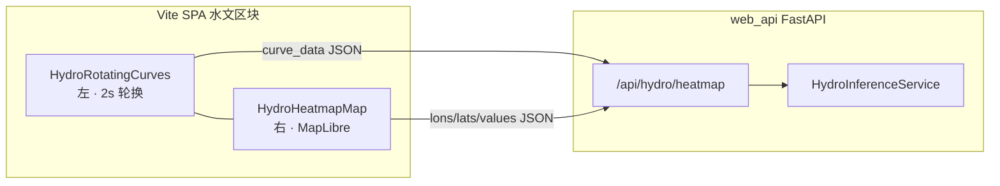

# 策略：第二套前端（Vite + React + MapLibre）+ FastAPI — 水文「曲线 + 地理热力图」

> **决策日期**：以仓库内文档更新为准。  
> **适用范围**：与 `docs/规划_实时系统与离线系统详细设计.md` **同一套离线/实时同屏产品**（左涡旋、右上水文、右下风浪）下的 **Vite SPA**；**不改变** `src/` 评测脚本、`run_eval_all.sh` 及 `相关文件/AI_DEV_REQUIREMENTS.md` 中的不可更改项。  
> **配套文档**：`docs/开发文档_新前端离线系统与实时系统.md`（工程落地）、`docs/规划_实时系统与离线系统详细设计.md`（产品目标态全文）。

---

## 0. 与《规划》文档的关系（含原始需求摘要）

《规划》文档由产品侧提示词归纳而来，核心约束包括：

- **离线 / 实时共用布局**：左侧涡旋整高；**右上水文**、**右下风浪**；压缩标题与上传区占比。  
- **涡旋（与单模块差异）**：整 NC 生成视频 FPS=1；生成后自动播放；有 NC 时间维则在画面上方显示时间戳；上下双画面同步（上无框、下有识别框）。  
- **水文（与单模块差异）**：同屏以 **区域均值曲线** 为主交互（多要素 **约 2 秒轮换**；**鼠标悬停图表则暂停轮换**）；缓冲不足时 **虚化 +「数据不足，等待中」**。**第二套前端在落实上述曲线行为的同时，在同一水文区块内增加「地理配准预测热力图」**（lon–lat + MapLibre），与曲线 **同时占位、同时可见**，不得由热力图独占水文区。  
- **风浪（与单模块差异）**：醒目等级色 + 固定模板多行摘要文本。  
- **Level 1**：涡旋/水文/风浪二级页（抽屉、全曲线、报告与外链等）**评估后实现**；新前端以 React 路由与 CSS 过渡承接较 Streamlit 更自然。

本策略文件定义：**技术栈、API 契约、热力图与曲线的数据边界**；**不**重复展开全文交互细节（以《规划》为准）。

---

## 1. 决策摘要

| 项 | 结论 |
|----|------|
| **第二套前端水文区块交付** | **①** 与 `HydroInferenceService.run` 同源的 **`curve_data` 区域均值曲线**（多要素轮换 + 悬停暂停 + 不足蒙层）；**②** **MapLibre 地理配准热力图**。二者 **同区块左右并排**（默认左曲线、右地图；窄屏自动纵向堆叠），与《规划》§2、§4 一致。 |
| **明确不做（本期）** | **异常告警地图**（格点级异常等级填色、与台风候选地图联动编辑等）不纳入本里程碑；风浪仍以 **同屏摘要占位 + Streamlit 深链** 为主，直至接入 `run_detect` 等 API。 |
| **技术栈** | **Vite + React**（仓库已选）+ **MapLibre GL JS**；后端 **`web_api` FastAPI**（包名避免与 `app/services` 冲突），仅 **编排** 调用现有 `HydroInferenceService` / `materialize_netcdf_to_xy_npz`，**禁止**在 API 层复制 ConvLSTM。 |
| **与 Streamlit 关系** | **并行**：Streamlit 承担单模块工作台、答辩默认路径；第二套前端承担 **规划 §2 同屏大屏形态** 与 **地图化热力图** 的联合演示。 |

---

## 2. 架构与职责边界

- **FastAPI**：校验路径 → 物化 NC → `run` → 返回 **热力图栅格** + **`curve_data` + `feature_names`**（与单模块 `hydro.py` 同源字段）。  
- **MapLibre**：`image`/`raster` source + 四至 `coordinates`（EPSG:4326）。  
- **曲线**：浏览器端 **SVG 或 Plotly**（当前实现为轻量 SVG）；轮换定时器在 **悬停暂停** 时 `clearInterval`，满足《规划》§4.3 验收口径。

---

## 3. 数据契约（`/api/hydro/heatmap` 响应）

在《规划》水文曲线语义之上，接口 **扩展** 下列字段（OpenAPI 以 `/docs` 为准）：

| 字段 | 类型 | 说明 |
|------|------|------|
| `lons` | `float[]` | 长度 `W`，单调递增 |
| `lats` | `float[]` | 长度 `H`，行与 `values` 对应（纬度递减时前端按已有规则翻转贴图） |
| `values` | `(float \| null)[][]` | `H×W`，当前请求 `feature` + `kind` 对应平面 |
| `feature` | `string` | 当前热力图要素 |
| `kind` | `"gt" \| "pred" \| "abs_err"` | 与 `map_data` 语义一致 |
| `lead_time_index` | `int` | 预报步索引 |
| `feature_names` | `string[]` | 全部输出要素名，供曲线轮换列表 |
| `curve_data` | `Record<string, {horizon, gt, pred}[]>` | 与 `HydroInferenceService.run` 的 `curve_data` 一致 |
| `meta` | `object` | 含 `T_need`、`T_hat`、`buffer_sufficient`；**不足时**曲线区与地图区均应蒙层/虚化（前端实现） |
| `crs` | `string` | 默认 `EPSG:4326` |

**备选**：未来可增 PNG + `coordinates` 以减轻 JSON 体积（非本期必须）。

---

## 4. 分阶段交付（与《规划》建议顺序对齐）

| 阶段 | 目标 | 验收 |
|------|------|------|
| **P0** | 同屏三区块壳 + 水文曲线占位 + 假/静态热力图 | 路由可打开，布局符合 §2.1 |
| **P1** | 真上传 + `/api/hydro/heatmap` 返回 lon/lat + `curve_data` | 曲线与热力图同屏；轮换/悬停行为可测 |
| **P2** | 真推理与 Streamlit 曲线/热力图数值抽样对拍 | 文档化抽样命令与截图 |
| **P3** | 涡旋双视频、风浪等级 API、Level 1 子路由（可选） | 按《规划》§6 分项验收 |

---

## 5. 工程与运维要点

- **CORS**：开发期允许 `http://127.0.0.1:5173`、`http://localhost:5173`；生产按域名收紧。  
- **路径安全**：仅允许仓库根相对路径及白名单目录（上传目录、`hydro_nc_cache`、`REALTIME_NC_POLL_DIR`）。  
- **依赖**：FastAPI、`uvicorn[standard]`、`python-multipart` 写入根目录 `requirements.txt`。  
- **包名**：后端目录为 **`web_api/`**，启动 `python -m uvicorn web_api.main:app`（**勿**使用与 `app/services` 冲突的顶层 `services` 包名）。

---

## 6. 文档一致性检查清单

- [x] `docs/策略_第二套前端与水文预测热力图.md`（本文）  
- [x] `docs/开发文档_新前端离线系统与实时系统.md`  
- [x] `docs/规划_实时系统与离线系统详细设计.md`  
- [x] `相关文件/下一步开发方向_数据入口实时离线与大屏.md`  
- [x] `web/README.md`、`web_api/README.md`  

---

*文档版本：v2.0 | 水文区块 = 《规划》曲线行为 + 本策略地理热力图*
